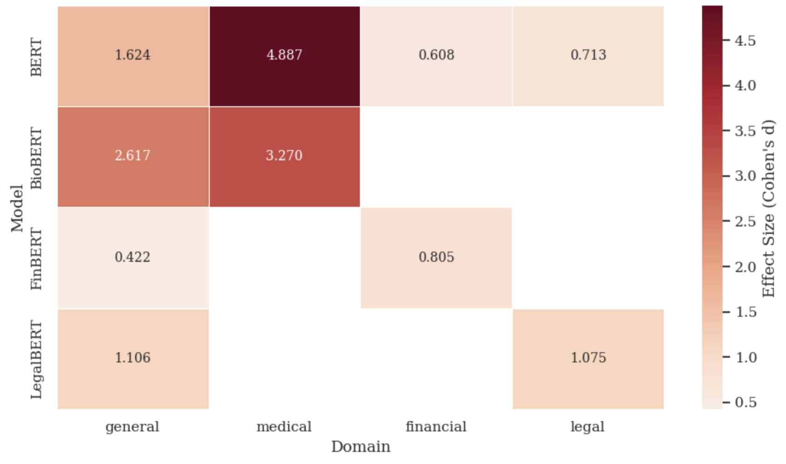

# When BERT Specializes: How Domain Pre-Training Reshapes Gender Bias

This repository contains the code, data, and results for a study evaluating gender bias across four BERT-family language models: BERT-base, BioBERT, FinBERT, and LegalBERT.

## Motivation

Domain-adapted language models are increasingly deployed in high-stakes settings; clinical decision support, financial risk assessment, legal document analysis. Under the EU AI Act (2024), such applications are classified as high-risk. Yet while the NLP community has studied bias in general-purpose models extensively, far less attention has been paid to how **domain-specific pre-training reshapes bias** in the specialized vocabulary these models will actually encounter in practice.

The central question: does continued pre-training on biomedical, financial, or legal corpora amplify, attenuate, or simply redirect gender bias relative to base BERT?

All four models share identical architecture (12 layers, 768 hidden dimensions, ~110M parameters). Any observed differences in bias are therefore attributable to **pre-training data alone**.

## Key Finding

Domain pre-training reshapes rather than uniformly amplifies gender bias — and the direction depends on both the domain and the evaluation method. Standard benchmarks can mask domain-specific bias patterns: **a model that looks unbiased on CrowS-Pairs may still strongly associate male terms with high-status roles in the vocabulary it uses most in practice.**


*C-WEAT effect sizes (Cohen's d) for gendered role associations. Most effects exceed d > 0.8 (large). FinBERT and LegalBERT amplify male–high-status associations relative to base BERT in their domains; BioBERT reduces the extreme medical-domain bias already present in BERT-base.*

## Evaluation Methods

| Benchmark | What it measures | N |
|---|---|---|
| **CrowS-Pairs** | Stereotype preference rate via pseudo-log-likelihood on minimal sentence pairs | 1,508 pairs, 9 bias types |
| **StereoSet** | Language modeling ability (LMS), stereotype preference (SS), and combined ICAT score | 2,106 intrasentence examples |
| **C-WEAT** | Cohen's *d* effect size for gendered role associations in contextualized embeddings, using 28 domain-specific sentence templates per domain | 4 domains × 2 role types |

## Models

| Model | Hugging Face ID | Pre-trained on |
|---|---|---|
| BERT | `bert-base-uncased` | Wikipedia + BookCorpus |
| BioBERT | `dmis-lab/biobert-base-cased-v1.2` | PubMed + PMC |
| FinBERT | `ProsusAI/finbert` | Financial reports + news |
| LegalBERT | `nlpaueb/legal-bert-base-uncased` | Legal texts, legislation, court decisions |

## Repository Structure
├── CrowSPairsBiasEvaluation.ipynb   # CrowS-Pairs stereotype preference analysis   
├── StereoSetBiasEvaluation.ipynb    # StereoSet LMS / SS / ICAT evaluation    
├── C_WEAT_BiasEvaluation.ipynb      # C-WEAT gendered role association analysis     
└── figures/                          # Output figures     

## Results Summary

- **CrowS-Pairs**: BERT-base is the most biased model overall and on gender specifically. FinBERT scores closest to the fair-model ideal (0.481), but this likely reflects its formal training corpus suppressing stereotypical surface language rather than genuine bias reduction — a methodological artefact, not a real finding.
- **StereoSet**: BERT-base and BioBERT perform best. FinBERT's severely degraded language modeling score (LMS = 40.43% vs. BERT's 69.85%) renders its stereotype scores uninterpretable.
- **C-WEAT**: FinBERT and LegalBERT amplify male–high-status associations relative to base BERT in their respective domains. BioBERT reduces the extreme medical-domain bias found in BERT-base (d = 3.27 vs. 4.89), consistent with biomedical literature's increasing emphasis on clinical role diversity.

## Full Report

For detailed methodology, results, and theoretical discussion, see the accompanying report:

> Jones, K. M. (2026). *When BERT Specializes: How Domain Pre-Training Reshapes (Gender) Bias*. University of Konstanz. [Read the report](./Report_When_BERT_Specializes_How_Domain_Pre-Training_Reshapes_(Gender)Bias.pdf)

## Citation

```bibtex
@report{jones2026bertspecializes,
  author    = {Jones, Katrina M.},
  title     = {When BERT Specializes: How Domain Pre-Training Reshapes (Gender) Bias},
  institution = {University of Konstanz},
  year      = {2026},
  month     = {March}
}
```

## Acknowledgements

Domain-specific C-WEAT sentence templates were developed with the assistance of Claude Sonnet 4.5 and subsequently reviewed for face validity.  Please see the Report for the full list of references. 

